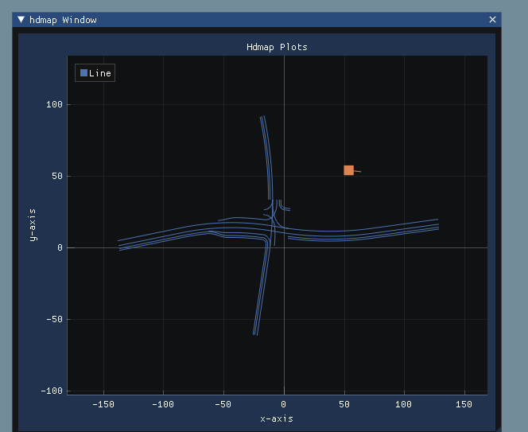

Project SimUI
=========

Show hdmap (apollo opendrive) based on imgui and implot

###### Test

1.windows

using vs2019，the main.cpp based on example_win32_directx12 of imgui。

Proprocessor Definitions add ImTextureID=ImU64;

2.linux

